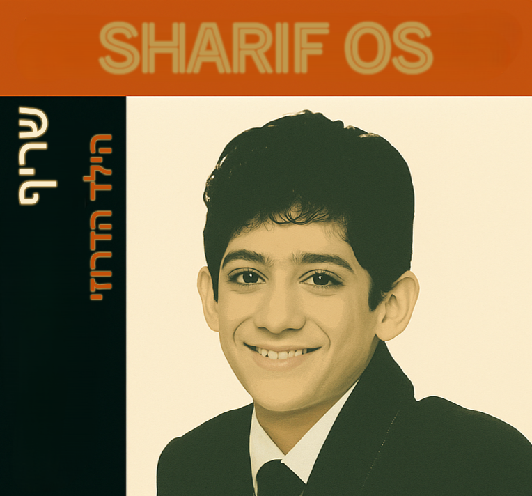

# SharifOS

## Build Cross-Compiler Environment

```bash
make build-env

# then
make run-env
```
-------


## Build Kernel & ISO (Inside Docker)
```bash
make clean
# First build may fail due to setup — run twice if needed
make
```
## Run
```bash
qemu-system-i386 -cdrom dist/sharifos.iso -m 256M
```

## Debug
```bash
qemu-system-i386 -cdrom dist/sharifos.iso -m 256M -s -S
gdb ./kernel/sharifos.kernel
```

## Documentation
```bash
make docs
```

## 🧹 Clean Build Artifacts
```bash
make clean
```
## Optional Scripts
```bash
./build.sh   # Builds kernel and headers (wrapper around `make`)
./iso.sh     # Creates ISO image (wrapper around `make iso`)
```